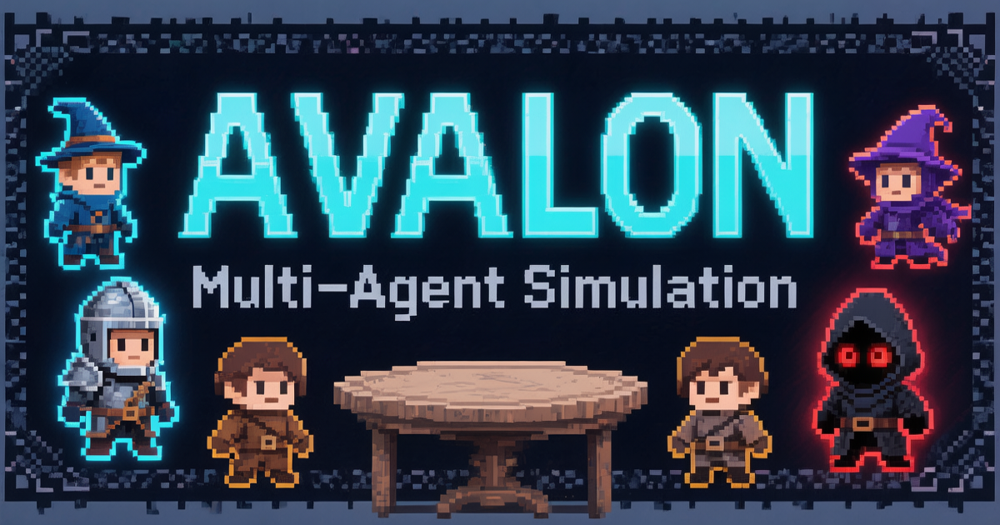

<p align="center">
  
</p>

<p align="center">
  <strong>6 个 LLM Agent 围坐圆桌，在推理与欺骗中展开博弈</strong>
</p>

<p align="center">
  <a href="#快速开始">快速开始</a> · <a href="#功能特性">功能特性</a> · <a href="#架构设计">架构设计</a> · <a href="#可视化系统">可视化</a> · <a href="README.md">English</a>
</p>

---

## 简介

这是一个基于《阿瓦隆》(The Resistance: Avalon) 桌游规则的 **多 Agent 沙盘模拟器**。6 名玩家全部由独立的 LLM Agent 扮演，它们需要通过自然语言讨论、推理、投票和欺骗来完成一场完整的阿瓦隆游戏。

每个 Agent 拥有独立的记忆系统和决策逻辑，只能获取自己角色应知的信息——梅林知道谁是坏人但不能暴露自己，刺客要在发言中寻找蛛丝马迹，莫甘娜伪装成梅林制造混乱。

项目支持 **单局模式**、**社区多局模式**（含反思学习与私聊交流），以及 **实时 WebSocket 仪表盘** 和 **离线回放** 两种可视化方式。

## 功能特性

### 完整的阿瓦隆游戏引擎

- **6 人标准局** — 正义阵营 4 人 (梅林、派西维尔、忠臣×2) vs 邪恶阵营 2 人 (莫甘娜、刺客)
- **5 轮任务制** — 队伍人数依次为 2、3、4、3、4
- **完整流程** — 夜晚身份确认 → 组队提名 → 自由讨论 → 投票表决 → 任务执行 → 刺杀阶段
- **信息不对称** — 严格遵守桌游规则，每个角色只获取自己应知的情报

### 智能 Agent 系统

- **独立记忆** — 每个 Agent 维护自己的记忆流，支持 LLM 摘要压缩，避免上下文溢出
- **角色扮演** — 系统提示词注入角色身份和策略指导，Agent 按角色特性自主决策
- **三层容错** — LLM 响应解析支持 JSON 提取 → 关键词回退 → 随机兜底，确保游戏不中断
- **模型灵活** — 支持任何 OpenAI 兼容 API，正义/邪恶阵营可配置不同模型

### 社区模式 — 多局进化

- **反思学习** — 每局结束后 Agent 回顾表现，迭代修订策略，积累经验教训
- **私聊系统** — 局间玩家两两私聊，LLM 分析对话内容更新信任度和友好度
- **社交网络** — 持久化的信任/友好度关系图谱，影响后续游戏中的判断
- **玩家画像** — 记录每个对手的行为风格和特征，跨局积累认知

### 可视化系统

- **实时仪表盘** — WebSocket 驱动，实时观看 Agent 讨论、投票、任务执行全过程
- **控制面板** — 支持暂停、单步执行、继续，方便观察每一步决策
- **上帝视角** — 一键切换，显示所有玩家真实身份和秘密投票详情
- **四标签面板** — GAME 日志 / AGENTS 档案 / LEARNING 反思私聊 / STATS 统计
- **时间轴导航** — 支持跳转到任意轮次/阶段，可调速自动播放


## 架构设计

```
┌──────────────────────────────────────────────────────┐
│                    可视化层                            │
│  server/          WebSocket 服务 + 异步运行器          │
│  viewer/          实时仪表盘 + 离线回放前端             │
├──────────────────────────────────────────────────────┤
│                   社区学习层                           │
│  community/       多局循环 + 反思 + 私聊 + 持久化       │
├──────────────────────────────────────────────────────┤
│                   核心引擎层                           │
│  engine/          游戏流程控制 (组队/投票/任务/刺杀)     │
│  agents/          Agent 决策 + 记忆管理               │
│  models/          角色/玩家/游戏状态数据模型            │
├──────────────────────────────────────────────────────┤
│                    基础设施                            │
│  config.py        全局配置                            │
│  llm_client.py    LLM API 封装 (OpenAI 兼容)         │
│  utils/logger.py  终端彩色日志 + 文件记录 + 事件回调    │
└──────────────────────────────────────────────────────┘
```

### 信息不对称矩阵

|  | 梅林 | 派西维尔 | 忠臣 | 莫甘娜 | 刺客 |
|--|------|---------|------|--------|------|
| 坏人身份 | 全知 | - | - | - | - |
| 梅林/莫甘娜 | - | 知道两人但不知道谁是谁 | - | - | - |
| 邪恶同伴 | - | - | - | 知道刺客 | 知道莫甘娜 |
| 投票票数 | 仅总数 | 仅总数 | 仅总数 | 仅总数 | 仅总数 |
| 任务失败票 | 仅数量 | 仅数量 | 仅数量 | 仅数量 | 仅数量 |

## 快速开始

### 环境准备

```bash
# 克隆项目
git clone https://github.com/haomes/avalon.git
cd avalon

# 安装依赖
pip install openai aiohttp

# 配置环境变量
cp .env.example .env
# 编辑 .env，填入你的 API 配置
```

`.env` 文件配置说明:

```bash
# 必填：API 端点地址 (支持任何 OpenAI 兼容 API)
API_BASE_URL=https://api.openai.com/v1/
API_KEY=your-api-key-here

```

### 运行游戏

**单局模式** — 运行一场完整的阿瓦隆游戏:

```bash
source .env  # 加载环境变量
python main.py
```

**社区模式** — 多局循环，Agent 会在局间反思学习:

```python
from community.community_runner import CommunityRunner

runner = CommunityRunner()
runner.run_n_games(10)  # 运行 10 局
```

**实时仪表盘** — 通过浏览器观战:

```bash
source .env
python -m server.websocket_server
# 浏览器访问 http://localhost:8080
```

**离线回放** — 打开 `viewer/index.html`，加载 `logs/` 目录下的 `replay_*.json` 文件。

### 配置说明

在 `config.py` 中可以调整:

| 配置项 | 说明 | 默认值 |
|--------|------|--------|
| `MODEL_CONFIG` | 正义/邪恶阵营使用的模型 | `dsv32` |
| `LLM_TEMPERATURE` | 模型温度参数 | `0.8` |
| `MEMORY_COMPRESS_THRESHOLD` | 记忆压缩触发阈值 | `30` |
| `REFLECTION_ENABLED` | 是否启用反思学习 | `True` |
| `PRIVATE_CHAT_ENABLED` | 是否启用私聊系统 | `True` |
| `PRIVATE_CHAT_MAX_PAIRS` | 每局最多私聊对数 | `3` |

## 项目结构

```
avalon/
├── main.py                       # 游戏入口
├── config.py                     # 全局配置
├── llm_client.py                 # LLM API 封装
├── models/                       # 数据模型
│   ├── role.py                   #   角色定义
│   ├── player.py                 #   玩家状态
│   └── game_state.py             #   游戏状态 (含序列化)
├── agents/                       # Agent 系统
│   ├── memory.py                 #   记忆管理 (LLM 摘要压缩)
│   └── agent.py                  #   Agent 决策封装
├── engine/                       # 游戏引擎
│   ├── game_engine.py            #   主引擎 (流程控制)
│   ├── night_phase.py            #   夜晚阶段
│   ├── team_phase.py             #   组队阶段
│   ├── vote_phase.py             #   讨论 + 投票
│   ├── mission_phase.py          #   任务执行
│   └── assassin_phase.py         #   刺杀阶段
├── community/                    # 社区模式
│   ├── community_runner.py       #   多局运行器
│   ├── reflection.py             #   反思系统
│   ├── private_chat.py           #   私聊系统
│   ├── persistent_agent.py       #   Agent 持久化
│   └── statistics.py             #   统计报告
├── server/                       # WebSocket 服务
│   ├── websocket_server.py       #   aiohttp 服务器
│   ├── async_game_runner.py      #   异步运行器
│   ├── event_emitter.py          #   事件广播器
│   └── commands.py               #   前端命令处理
├── viewer/                       # 前端可视化
│   ├── dashboard.html            #   实时仪表盘
│   ├── index.html                #   离线回放
│   ├── css/                      #   样式文件
│   └── js/                       #   JavaScript 模块
├── assets/                       # 项目图片资源
├── logs/                         # 游戏日志 (gitignore)
└── data/agents/                  # Agent 持久化数据 (gitignore)
```

## 技术亮点

- **Memory 分层压缩** — 近期记忆完整保留，早期记忆经 LLM 压缩为结构化摘要，失败时回退硬截断
- **LLM 响应三层容错** — JSON 解析 → 关键词回退 → 随机兜底，保证游戏流程不中断
- **异步状态机** — WebSocket 运行器支持暂停/步进/停止，每个关键步骤插入 checkpoint
- **60+ 种事件类型** — 从后端推送到前端，驱动实时渲染
- **策略迭代修订** — 反思系统基于本局行为+历史策略进行增量修订，而非全量重写
- **跨局历史持久化** — 仪表盘自动保存每局快照，支持跨局对比分析

## License

MIT
